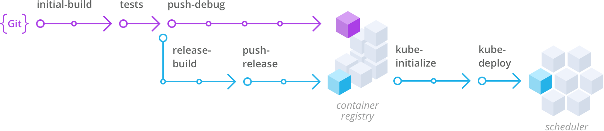

##  React Todo Redux

Sample Todo application that showcases [Wercker Workflows](http://wercker.com/workflows/) in action alongside [Kubernetes](http://kubernetes.io) and [CoreOS Quay.io](http://quay.io)

This sample application shows two Workflows. Please see the `wercker.yml` file for more details.

### Build Development Container

The first Workflow builds our initial image, runs unit tests and pushes our container to a container registry.
We can leverage this container for development purposes and share the container amongst our team.

### Build Production-ready Container

The second Workflow continuous after our test pipeline and builds a production ready container that gets
pushed to a registry.

Finally, we use the [kubectl step](https://github.com/wercker/step-kubectl) to initialize the cluster and do a rolling update of our service.

You can see a visual representation of the Workflows below.

